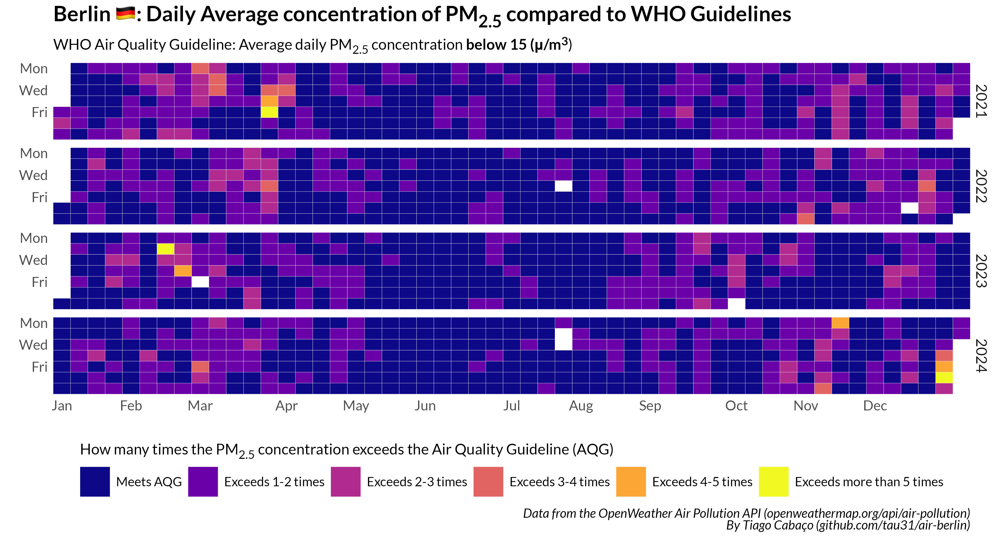

## Air Quality in Berlin

Following the report form IQAir, stating that ["only 7 countries world wide meet WHO dirty air guidelines"](https://www.theguardian.com/environment/2025/mar/11/only-seven-countries-worldwide-meet-who-dirty-air-guidelines-study-shows),
I wanted to analyze these metrics for the city of Berlin, particularly the concentration of toxic PM2.5<\sub> particles.

Data is fetched from the OpenWeather API: [Air Pollution API](https://openweathermap.org/api/air-pollution). 

